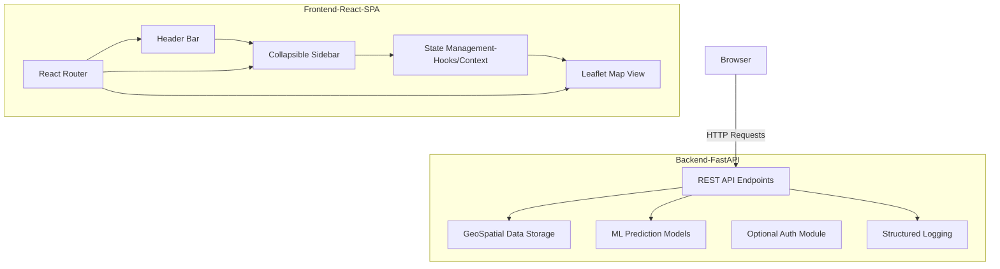
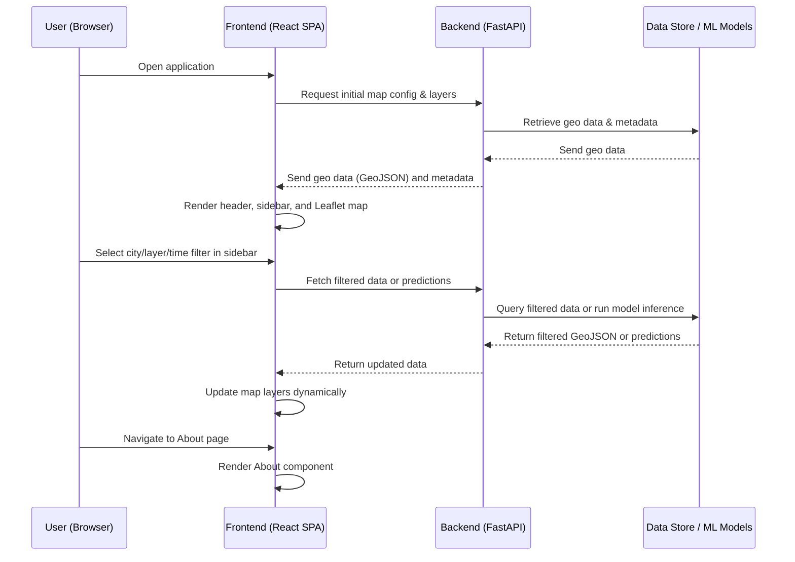
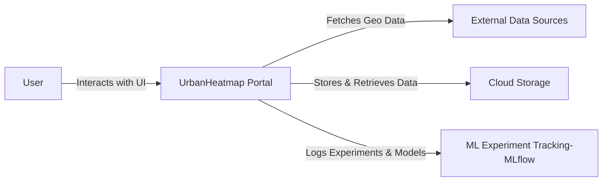

Certainly! Here is a **professional architecture document** for the UrbanHeatmap portal-style application. It includes structured sections with detailed descriptions and illustrative diagrams: **Component Diagram**, **Workflow Diagram**, and **Context Diagram**.

---

# UrbanHeatmap Application Architecture Document

---

## Table of Contents

1. Introduction
2. Architectural Overview
3. Component Diagram
4. Workflow Diagram
5. Context Diagram
6. Technology Stack
7. Deployment & Infrastructure
8. Non-Functional Requirements
9. Ethical & Societal Considerations
10. Conclusion

---

## 1. Introduction

This document defines the architecture of the UrbanHeatmap portal-style web application. The system aims to provide interactive urban heat visualization and analytics via a user-friendly portal interface, supporting multiple cities, data layers, and time filtering.

---

## 2. Architectural Overview

UrbanHeatmap adopts a **modern client-server architecture** with a React frontend and FastAPI backend. The frontend is a Single Page Application (SPA) with:

* Persistent Header Bar
* Collapsible Sidebar for data/layer control and explanations
* Main interactive Leaflet map viewport
* Internal routing (React Router) for About and other pages

The backend exposes RESTful APIs for serving geo-spatial data (GeoJSON), metadata, and future ML-powered heatmap predictions.

---

## 3. Component Diagram

**Description:**

* Frontend components communicate internally via React state/context.
* Frontend interacts with backend APIs over HTTP for data and predictions.
* Backend encapsulates data management, model inference, and logging.

---

## 4. Workflow Diagram

**Description:**
This flow describes initial data loading, user interaction triggering data refresh, and internal SPA navigation.

---

## 5. Context Diagram

**Description:**
The system interacts with users via the web app and consumes external urban heat and socio-economic data. Data and models are stored and managed securely, and MLflow tracks experiments.

---

## 6. Technology Stack

| Layer               | Technology                                    | Description                            |
| ------------------- | --------------------------------------------- | -------------------------------------- |
| Frontend            | React, React Router, Leaflet.js               | SPA UI, routing, interactive maps      |
| Styling             | CSS Modules / Styled Components or MUI        | Responsive and accessible UI           |
| Backend             | FastAPI (Python), Uvicorn                     | RESTful API server                     |
| Data Storage        | GeoJSON files / PostgreSQL + PostGIS (future) | Spatial data management                |
| Machine Learning    | Python (scikit-learn, XGBoost, custom models) | Heatmap prediction & analysis          |
| DevOps              | Docker, Docker Compose, VS Code DevContainer  | Containerized development & deployment |
| Experiment Tracking | MLflow                                        | Model and data experiment tracking     |
| Logging             | Python logging (JSON format), Browser Console | Structured logging and error tracking  |

---

## 7. Deployment & Infrastructure

* **Containerization:** Both frontend and backend are containerized using Docker.
* **Orchestration:** Docker Compose used for local development to run frontend, backend, and MLflow services.
* **Cloud Deployment:** The system can be deployed on Kubernetes or cloud VM, with scalable backend API, CDN for frontend, and persistent storage for data/models.
* **CI/CD:** GitHub Actions or similar pipelines automate builds, tests, and deployments.
* **Monitoring:** Logging aggregated via ELK stack or cloud logging solutions; MLflow UI accessible for experiment review.

---

## 8. Non-Functional Requirements

* **Performance:** Fast API responses and map rendering, use caching where appropriate.
* **Accessibility:** WCAG 2.1 compliance, screen-reader support, keyboard navigability, color-blind friendly palettes.
* **Security:** HTTPS enforcement, CORS policy, input validation, safe API design.
* **Scalability:** Modular design allows adding cities, data layers, and features without refactoring.
* **Maintainability:** Modular codebase, standardized naming, documentation, automated tests.

---

## 9. Ethical & Societal Considerations

* **Transparency:** Openly document data sources and AI model logic.
* **Participation:** Include user feedback mechanisms and community input in design iterations.
* **Inclusion:** Ensure UI accessible to all users and supports multi-language.
* **Fairness:** Monitor data/model biases, ensure no social groups are disadvantaged by heatmap predictions.
* **Sustainability:** Optimize for resource efficiency and SDG alignment (esp. SDG 11 & 13).

---

## 10. Conclusion

This architecture provides a robust foundation for UrbanHeatmap, balancing modern web standards, scalability, user experience, and ethical considerations. It will evolve with the project’s growing data and analytical needs, supporting participatory urban climate resilience.

---

If you want, I can help generate the diagrams as images or in code (e.g., Mermaid or PlantUML) so you can embed them into documentation or presentations. Would you like that?
